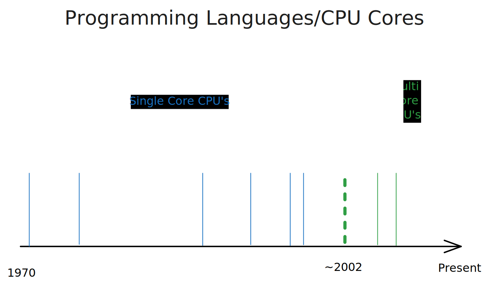

In short, it gives you more options in your toolbox.

While JavaScript is very flexible and with Node.js you can use it in many areas, there are areas where Go excels, due to simply being a more modern language.

## A language for the modern CPU

When you look at the graph below, you'll find that the most popular programming languages, including JavaScript, were invented in the last century:

What's more, most of the popular programming languages were invented before the rise of multi core architecture. While they all have support for concurrency (executing multiple tasks at the same time), they were not designed with that in mind.

Go, on the other hand was designed with this concurrency and shift in CPU architecture in mind.

## Built for concurrency

It's therefore no surprise that Go is used as the foundation for many infrastructure projects, like Docker, Kubernetes, and Terraform, where you need to call out to other services or wait for multiple asynchronous tasks to finish. While you _could_ create these services in other languages, Go's concurrency model and language syntax makes it really easy to do so.

## Fast

Go is compiled directly to machine code, giving it a significant speed advantage over interpreted languages like JavaScript. While JavaScript engines are highly optimized, compiled Go code often achieves superior performance.

This performance edge is so compelling that the TypeScript team even announced that [they are rewriting their compiler in Go](https://devblogs.microsoft.com/typescript/typescript-native-port/). The trend towards Go for speed is also evident in other JavaScript tooling projects like [esbuild](https://esbuild.github.io/).

## Transferable skills

If you already have JavaScript/TypeScript knowledge you'll find it easy to pick up Go. Much of Go's syntax will feel familiar as it's C-like, similar to JavaScript. For unique Go syntax, like goroutines (concurrency), you'll find that they are easy to understand and use as well. As such, many find Go much easier to pick up than other modern system programming languages like Rust.

## Batteries included

Unlike many traditional system programming languages like C and C++, Go comes with a lot of batteries included.

It comes with a testing framework, a package manager and even a linter. In addition it has a very powerful standard library. Like Node.js, Go makes it very easy to work cross platform, despite being a compiled language. If you've ever tried to setup a C/C++ project, you'll know the pain.

## Easier deployments

Go applications compile to a single, self contained executable. This often makes deployment incredibly straightforward: just copy that executable to your server and run it. No need to install a runtime or package manager.

In contrast, deploying Node.js applications typically involves several steps. Installing Node.js, ensuring it's the right version and copy all project files (like `package.json` and source code) to the server to finally run `npm install`.

Go's approach often means faster, more reliable deployments with fewer moving parts and less setup.

## WebAssembly

With Go's excellent WebAssembly support, you can execute Go code in browsers. This often translates to superior performance over JavaScript for CPU heavy tasks, opening the door for more complex client-side processing. Simply put, it gives you more options in your toolbox as a web developer.
